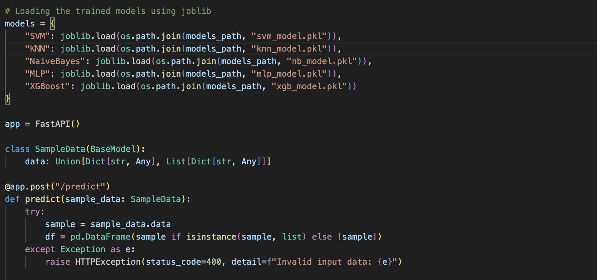
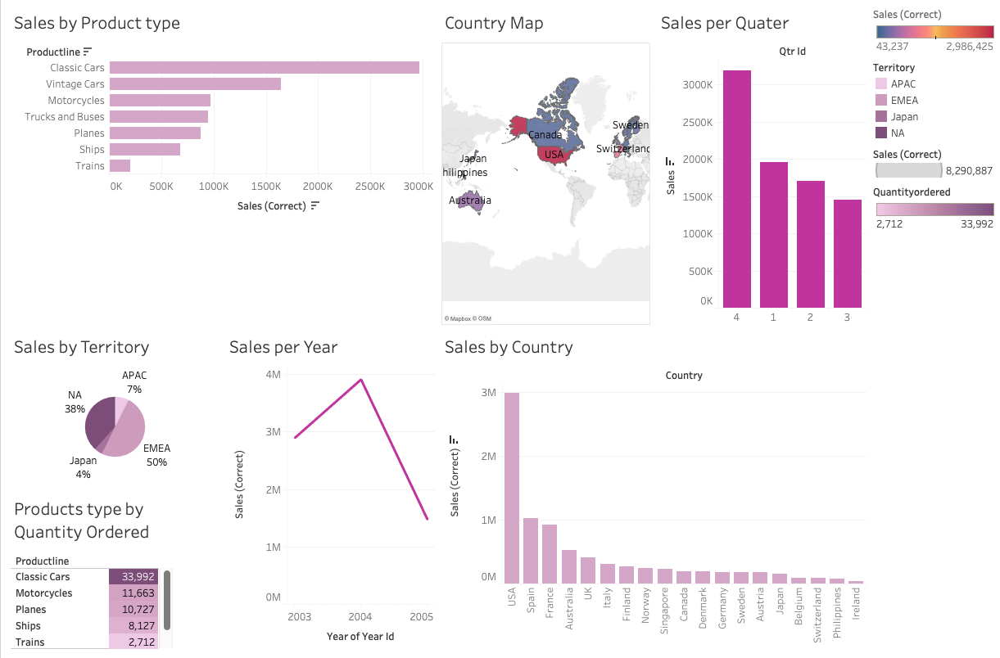
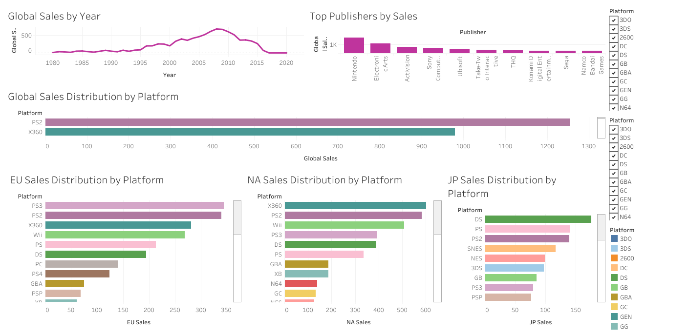
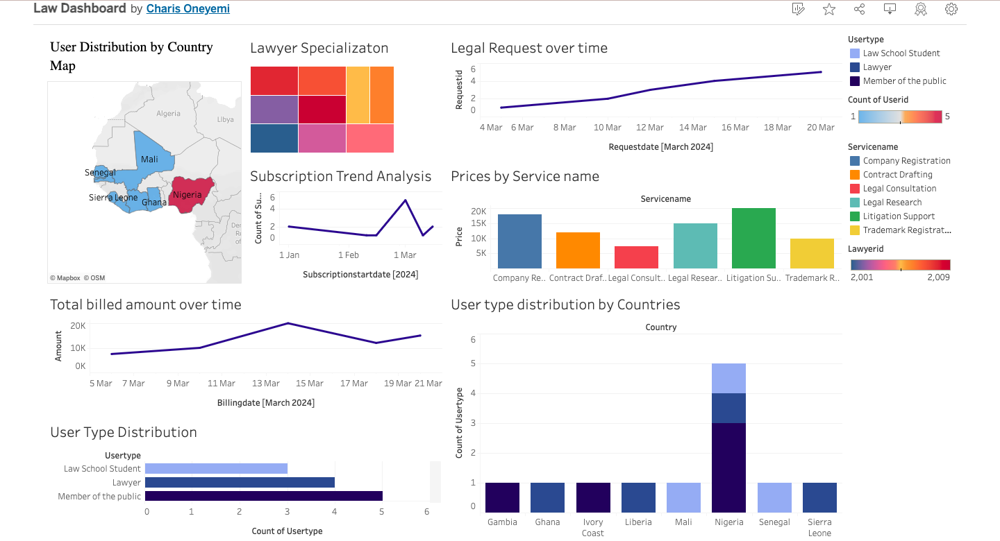
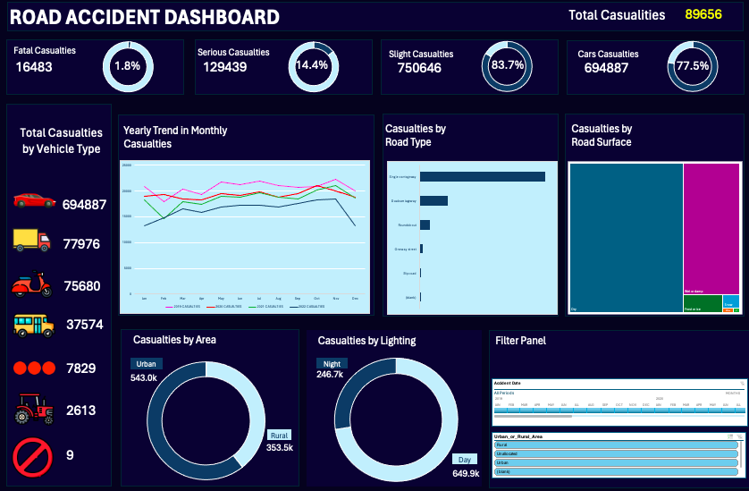
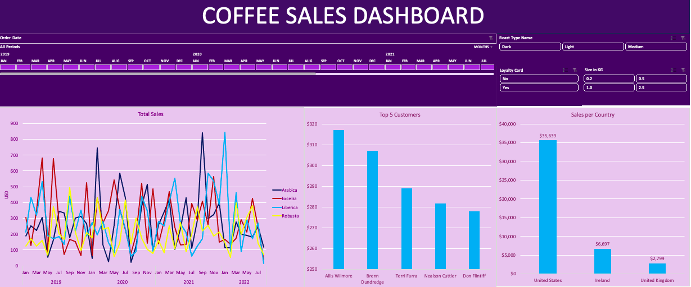

# Isaiah 60 | Data Scientist | MSc Data Science Student

#### Technical Skills: SQL, Tableau, Excel, Python
#### LinkedIn: linkedin.com/in/charisoneyemi
#### Gmail: charisoneyemi@gmail.com

## Education
- MSc Data Science | Pan Atlantic University (2024-2025)
- BSc Management Information System | Covenant University (2017-2022)

## PYTHON ML Projects
### Fraud Detection Model and Deployment

For this project, I developed and deployed a fraud detection system using multiple machine learning models, including Support Vector Machine (SVM), K-Nearest Neighbors (KNN), Naïve Bayes, Multi-Layer Perceptron (MLP), and XGBoost.

Key Steps:
- Data Preparation: Processed a credit card transaction dataset to identify fraudulent activities.
- Model Training: Trained multiple classifiers to detect fraud, optimizing them for accuracy and efficiency.
- Model Evaluation: Compared model performances to determine the best approach.
- Deployment: Built APIs using FastAPI and Flask to serve real-time fraud detection predictions.
- Testing: Used Postman to validate the API responses.
[Python Machine Learning Model](https://github.com/Tsemaye/Python-Machine-Learning)

## TABLEAU Projects
### Retail Sales Data Analysis: A First Glance

As part of the HNG data analytics internship, we were tasked with exploring a dataset and writing a technical report based on our findings. I chose the Retail Sales Dataset available on Kaggle, and the goal was to examine the data, identify initial trends, and communicate these findings effectively. This report presents my observations and initial analysis using a Tableau dashboard created to visualize the key aspects of the data.
[Retail Sales Data Analysis](https://charisoneyemi.wordpress.com/2024/06/28/retail-sales-data-analysis-a-first-glance-2/)

### Video Game Analysis

[Video Games Sales Analysis Dashboard.png
](https://github.com/Tsemaye/portfolio/blob/main/Video%20Games%20Sales%20Analysis%20Dashboard.png)

My portfolio delves into the analysis of the video game industry, exploring various dimensions such as top publishers by sales, global sales trends over the years, and detailed sales distribution across different platforms and regions including Europe, North America, and Japan. Through this analysis, I provide insights into market dynamics, platform preferences, and regional variations.
[[Publication](https://www.mdpi.com/1424-8220/22/8/3048)
](https://public.tableau.com/app/profile/charis.oneyemi7497/viz/VideoGameAnalysis_17101490196120/VideoGamesSalesAnalysisDashboard)

### Legal Services Analysis

The Legal Services Analysis dashboard shows the data of a sample company which specialises in legal services.
[Legal Services Analysis](https://public.tableau.com/views/LawDashboard_17108603340770/Dashboard1)

## EXCEL Projects
### Accident Data Analysis

Within this section of my portfolio, I present a detailed analysis of accident data, covering various dimensions such as accident severity, date, month, and year of occurrence, geographical location (latitude and longitude), light conditions, district area, number of casualties and vehicles involved, road surface conditions, road type, urban or rural area classification, weather conditions, and vehicle type. By examining these variables, I offer valuable insights into the patterns and factors contributing to accidents, facilitating a deeper understanding of road safety dynamics. This analysis aims to inform policy-making, urban planning, and public safety initiatives by identifying trends, risk factors, and potential interventions to mitigate the impact of accidents on communities and individuals.

https://bit.ly/3uZrrTk

### Coffee Sales Analysis

Within this section of my portfolio, I delve into the detailed analysis of coffee sales data, encompassing various aspects such as product ID, coffee type, roast type, size... This analysis provides valuable insights for coffee businesses, retailers, and distributors to optimize their product offerings, pricing strategies, and marketing initiatives, ultimately enhancing customer satisfaction and driving business growth within the coffee industry.

https://bit.ly/3IyZ0Pe

## SQL Projects
### Employee Data Analysis

https://github.com/Tsemaye/SQL

This portfolio section showcases a series of SQL queries and data analysis techniques applied to employee demographics and salary data. The queries retrieve specific subsets of data, perform data manipulation and aggregation, and utilize functions like JOIN, GROUP BY, and CASE statements to derive insights such as age distributions, gender ratios, job title frequencies, and salary adjustments. Through these queries, the portfolio demonstrates proficiency in SQL query writing, data filtering, aggregation, and transformation, highlighting the ability to extract meaningful insights from datasets and support data-driven decision-making processes.

## Work Experience
  
**App Support Volunteer  @ YouVersion (_June 2024 - Present_)**
- Provided technical support to YouVersion users around the world, helping them navigate the Bible app and deepen their faith.

- Troubleshooted app issues and answered user questions in a clear, concise, and patient manner.

- Contributed to a positive user experience by ensuring users could effectively utilize YouVersion's features for daily Bible study and devotionals.

- Supported a diverse community by providing technical support to diverse cultures to help them navigate the Bible app and deepen their faith.

 
**NYSC Basic Technology Instructor/Teacher  @ Government of Nigeria - NYSC (_June 2022 - May 2023_)**
- Cultivated a positive and collaborative classroom environment, promoting a conducive learning atmosphere.

- Delivered comprehensive instruction to over 200 students on basic technology concepts and skills.

- Collaborated with colleagues and parents, facilitating effective communication and contributing to student development.

- Guided students in utilizing educational websites and search engines for homework and projects.

**Administrative Intern @ Quantum Business School (_June 2020 - Nov 2020_)**
- Supported administrative tasks, including filing, document preparation, and office organization.
- Scheduled and managed appointments to ensure smooth daily operations.
- Responded to customer inquiries and provided general office assistance.
- Assisted with day-to-day office workflow, contributing to a productive work environment.

