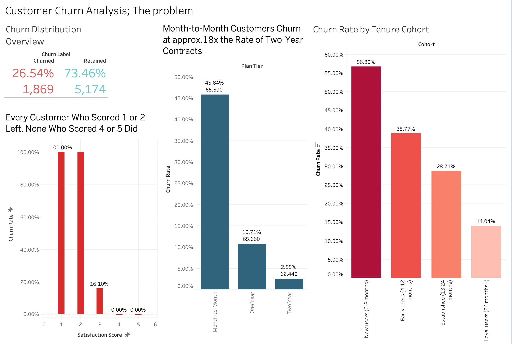
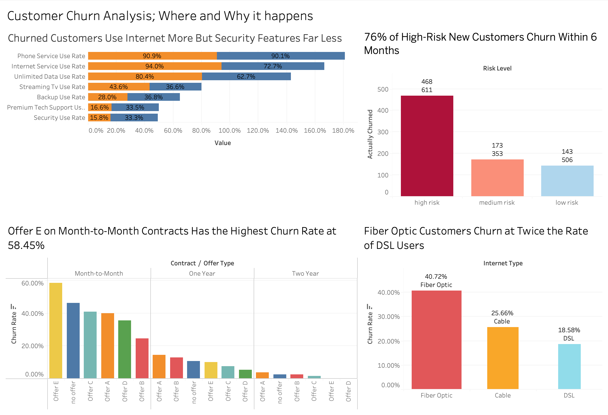
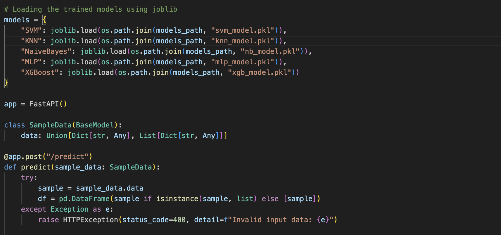
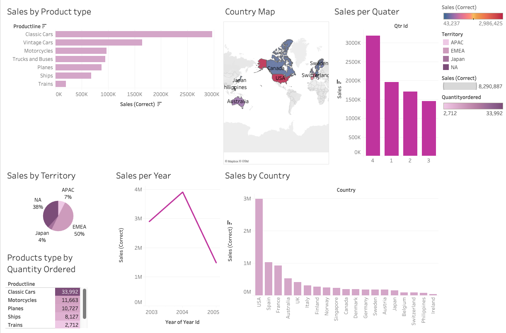
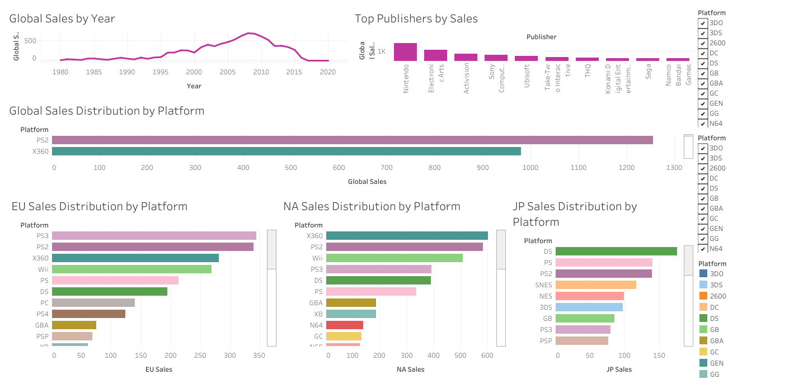
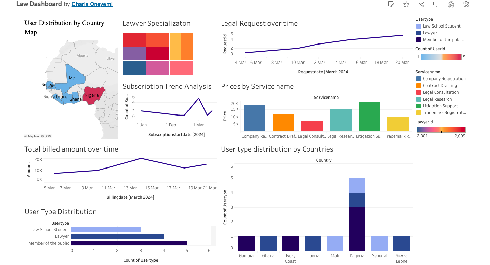
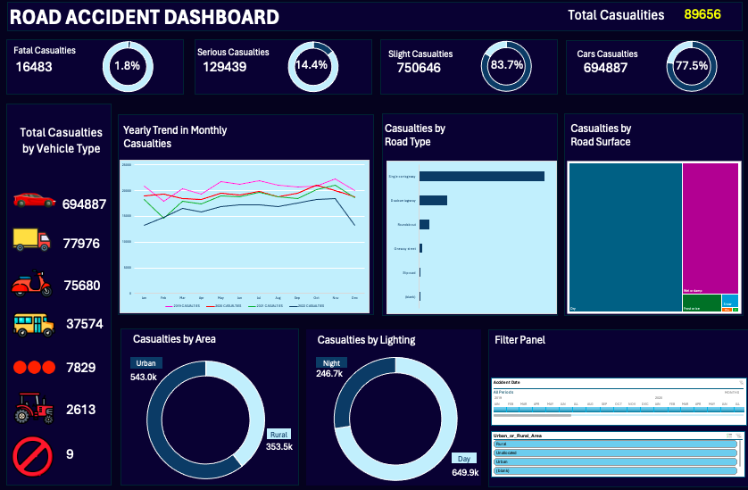
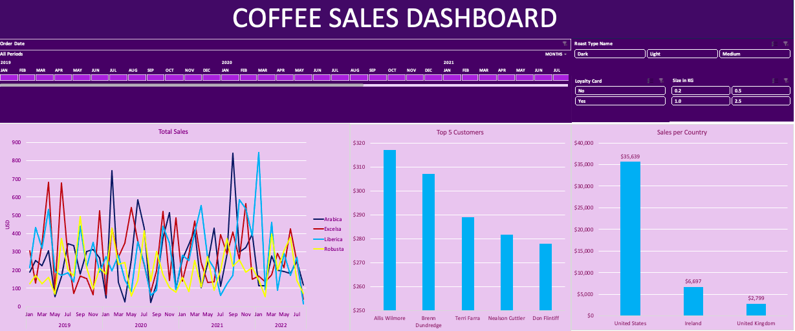

# Product Operations & Analytics | MSc Data Science 

#### Skills: Product Operations, Growth Analytics, Cross-Functional Execution, Stakeholder Communication, SQL, Python (Pandas, Scikit-Learn), Tableau, Data Visualization, Cohort Analysis, Retention Analysis, Customer Segmentation, Dashboard Development, Process Design, KPI Tracking, Workflow Documentation, Experimentation Thinking
#### LinkedIn: linkedin.com/in/charisoneyemi
#### Gmail: charisoneyemi@gmail.com
#### GitHub: https://github.com/Tsemaye

---

## Education
- MSc Data Science | Pan Atlantic University (2024-2025)
- BSc Management Information System | Covenant University (2017-2022)

## Product & Analytics Projects
### Customer Churn & Retention Analysis
#### PostgreSQL • Tableau 
Analyzed churn behavior across 7,000+ telecom customers to identify onboarding failures, retention risks, and feature adoption patterns affecting customer retention.

#### Key Insights
• New customers churned at 56.8%

• Month-to-month users churned 18x more than long-term contract users

• Customers with low satisfaction scores consistently churned

• Retention improved significantly after long-term commitment

#### What I Explored
• Cohort retention analysis

• Feature adoption patterns

• Customer risk segmentation

• Offer effectiveness

• Contract behavior analysis

#### Full Case Study
* [**Detailed Project Breakdown & Recommendations**](https://drive.google.com/file/d/1YFGWGgIegadBB__hNtyPq89vyoz40_ar/view?usp=sharing)
* [**Interactive Dashboard: The Churn Problem**](https://public.tableau.com/views/TheChurnProblem/TheChurnProblem?:language=en-GB&publish=yes&:sid=&:redirect=auth&:display_count=n&:origin=viz_share_link)
* [**Interactive Dashboard: Where & Why It Happens**](https://public.tableau.com/views/CustomerChurnAnalysisWhereandWhyithappens/WhereWhyItHappens?:language=en-GB&publish=yes&:sid=&:redirect=auth&:display_count=n&:origin=viz_share_link)

---

### Fraud Classification Model and Deployment

Built and compared multiple ML models (XGBoost, SVM, KNN, MLP) for fraud classification and evaluated performance trade-offs across financial transaction data.
[Python Machine Learning Model](https://github.com/Tsemaye/Python-Machine-Learning)

## Additional Projects

### Retail Sales Data Analysis: A First Glance

Exploratory Tableau dashboard analyzing retail sales trends, customer behavior, and operational performance metrics.
[Retail Sales Data Analysis](https://charisoneyemi.wordpress.com/2024/06/28/retail-sales-data-analysis-a-first-glance-2/)

### Video Game Analysis

[Video Games Sales Analysis Dashboard.png
](https://github.com/Tsemaye/portfolio/blob/main/Video%20Games%20Sales%20Analysis%20Dashboard.png)

Analyzed global video game sales trends across publishers, platforms, genres, and regions using Tableau dashboards. Explored market performance patterns and regional differences in consumer behavior.
[[Publication](https://www.mdpi.com/1424-8220/22/8/3048)
](https://public.tableau.com/app/profile/charis.oneyemi7497/viz/VideoGameAnalysis_17101490196120/VideoGamesSalesAnalysisDashboard)

### Legal Services Analysis

Built an operational dashboard for a legal services company to track performance metrics, workflow activity, and business operations for decision-making support.
[Legal Services Analysis](https://public.tableau.com/views/LawDashboard_17108603340770/Dashboard1)

### Accident Data Analysis

Explored accident trends across geography, road conditions, weather, and vehicle types to identify factors influencing accident severity and road safety outcomes.
https://bit.ly/3uZrrTk

### Coffee Sales Analysis

Analyzed coffee sales performance across product categories, roast types, sizes, and customer segments to uncover sales trends and business opportunities.
https://bit.ly/3IyZ0Pe

### Employee Data Analysis

https://github.com/Tsemaye/SQL

Wrote SQL queries using JOINs, CASE statements, GROUP BY, aggregations, and filtering techniques to analyze employee demographics, salaries, and workforce trends.

## Work Experience

**Product & Operations Associate  @ Maestroverse (_October 2025 - Present_)**
Coordinated cross-functional execution across engineering, design, and social media teams in a pre-launch startup environment. Built and maintained internal documentation, workflows, and knowledge systems in Notion to support structured decision-making. Defined success criteria and tracked execution against milestones, flagging risks and driving resolution across teams. Served as the primary communication bridge between the founder and all functional teams, ensuring clarity and accountability on priorities.

  
**Partner Support Volunteer  @ YouVersion (_June 2024 - February 2025_)** 
Analyzed 250+ recurring user inquiries to identify patterns and surface insights that improved internal support workflows. Synthesized user feedback into structured reports communicated to internal teams for process improvement. Maintained documentation and knowledge systems to improve response quality and operational efficiency.

 
**Basic Technology Instructor/Teacher  @ National Youth Service Corps (_June 2022 - May 2023_)**
Communicated technical concepts clearly to non-technical audiences and iterated on delivery based on feedback. Managed scheduling, resources, and operations for a structured learning environment of 200+ students.

**Administrative Intern @ Quantum Business School (_June 2020 - Nov 2020_)**
Supported day-to-day administrative operations including scheduling, documentation, and process coordination. Identified inefficiencies in client scheduling and implemented workflow improvements that increased operational efficiency.

Isaiah 60
